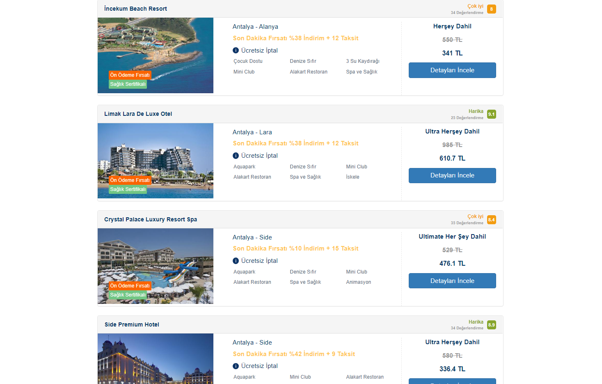

## Available Scripts

In the project directory, you can run:

### `npm install`

To install dev dependencies.

Run the project:

### `npm start`

Execute ### `npm run gulp-build` to run all tasks, launch the browser sync local server and watch for changes.

Runs the project in the development mode.\
Open [http://localhost:1234](http://localhost:1234) to view it in the browser.

